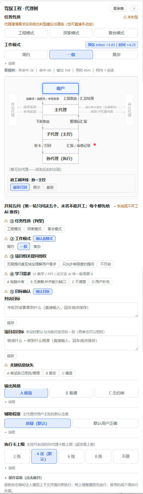

<div align="center">

# 🛠️ 驾驭工程模式

**Harness Engineering — DeepSeek Harness Agent Preset**

*通过分层委派子代理的方式，让 agent 用确定的、可声明的时间与 token 成本，换回更优质量的工作成果——把不可控的返工风险，变成可控的过程投资。*

</div>

[](https://www.npmjs.com/package/dsh-harness-preset) []() []() [](LICENSE)

> 🌏 中文为主。English edition 在路线图上（方法论术语体系较深，欢迎 PR 协助翻译）。

---

**驾驭工程**覆盖的不只是写代码：开工前把目标写成可验收的条款，执行中把过程摆在明面上，交付时拿证据说话。它是一套**每条规则都有真实事故背书**的工作纪律——小改动直通执行，复杂项目自动升级为三层编排＋对抗审计。纯提示词实现，零插件，官方桌面端开箱即用。

## 30 秒上手

**官方桌面端（DeepSeek Harness 0.2.x，推荐）**：桌面端「插件」→「+ 添加插件」→ 安装源填 **npm 包名 `dsh-harness-preset`**（或本仓库地址 `https://github.com/dg17dog/dsh-harness-preset`，或 clone 后本地目录选仓库根）→ 安装并启用 → 新会话选「驾驭工程模式」。

**npm 版 dsh（0.1.5.x）**：

```powershell
Copy-Item -Recurse -Force "<仓库>\preset\harness" "$env:USERPROFILE\.dsh\.agent-presets\harness"
# 新开会话，preset 选择器选「驾驭工程模式」（热扫描，无需重启）
```

**10 秒自检**：问它"你运行在什么模式？"——应自报模式名并列出开局五问。
**任务跑完后**：`node tools/check-workflow-compliance.mjs --cwd "你的项目工作区"`，退出码 = 违规规则数。

> npm 包页：[npmjs.com/package/dsh-harness-preset](https://www.npmjs.com/package/dsh-harness-preset)｜GitHub 仓库（含完整方法论与测试物证）：[dg17dog/dsh-harness-preset](https://github.com/dg17dog/dsh-harness-preset)
> 会话内 `subagent` / `subagent_fork` 本 preset 自带（与出厂 standard 同构）；侧边栏、智能体团队为桌面端官方自带。web 端可选装 [`flow-panel/`](flow-panel/README.md) 观测面板（纯仪表盘，不拦截，不装也完整可用）。

## 三种开局：按你的处境选

| 你的处境 | 开局模式 | 你会得到 |
|---|---|---|
| 目标明确——做个功能、修个 bug、重构一块 | **工程模式** | 条款冻结 → 三层子代理执行 → 带验收证据的交付 |
| 目标开放——调研、选型、可行性、找方向 | **探索模式** | 一张**维度清单表**：逐维值＋证据路径＋负发现，可逐格检查 |
| 你要做一个自己毫无头绪的东西 | **复合模式** | 先探索收敛成结论，你放行后无缝转工程执行 |

## 它长什么样

你说："帮我做一个团队回顾板网页。"然后走开泡咖啡。

它**不会**直接扑上去写代码。它先问五个问题（判型、工作模式、提问授权、学习需求、目标确认——每个都带 AI 推荐，你只需选）；把你的回答写成一份带验收条款的规格，**交你签字**；签字后条款冻结，它派一个主控子代理建看板、拆任务卡，孙代理领卡干活——每张卡都带行为边界和验收判据。

期间你随时能看到它的飞行记录仪——每轮回复的第一行：

```
[驾驭|判型=工程|模式=一般|卡上限4已派2|阶段=执行|冻结=无]
```

**为什么这么绕？三层编排的全部目的，是保住主代理的上下文。** 主代理不亲自干活，才能留足上下文预算，保持足够的智力水平——给你当决策参谋、对交付做兜底验收，而不是被中间过程的海量细节撑到"变笨"。也因此这套流程**天生支持全自动**：你把审核权整体交给主代理，它会按同一套纪律自主判型、自主放行、自主触发审计并全程留痕——纪律在，全自动才可信。

交付时它给的不是一句"做完了"，而是三件套：完成了什么、**证据在哪**（断言全 PASS 的输出、产物路径）、没找到什么。缺一样，你可以拒收。

和高风险操作之间还隔着一道**对抗式审计**：独立审计代理的任务不是核对清单，而是"证明它不合格"——找不到 3 个问题就得交代搜索过哪些角落。审计意见逐条裁定、留痕、回写。

## 和白板 agent 的差别

| | 白板（裸 agent 直接派活） | 驾驭工程模式 |
|---|---|---|
| **开工方向** | 拿到模糊需求猜着干，方向偏了整个重来 | 目标/范围/验收写成条款，**你签字才开工** |
| **长时间工作** | 前十分钟令人惊艳，一小时后开始跑偏、自由发挥，你不敢走开 | 方向/预算/纪律开工前锁死，子代理接力、循环验收——实测可连续跑 8 小时不用盯 |
| **"完成"的标准** | 它说完成就是完成，你负责逐行检查 | 验收断言全 PASS + 三件套（完成什么/证据在哪/没找到什么）+ 自证清单，**缺一样可以拒收** |
| **调研（探索模式）** | 顺着第一印象写一篇浅尝辄止的综述，查了什么、漏了什么无从知道 | **维度化拆解**：扩展维度+理由、逐维值+证据、**负发现**（排除了什么也是结论）——调研产出是一张可逐格检查的表，不是一篇作文 |
| **出错之后** | 不知道哪一步错的，一团浆糊 | 四级权限表 + 逐级上报 + 事后机检，违规可定位、可追责 |
| **能力自知** | 接活时根本不评估自己能不能胜任，闷头就干，能力不够就硬编 | **开工前先问学习需求**：本机已有能力？无装载就先派学习子代理补齐缺口再干活——补课在开工前，不在翻车后 |
| **关键信息缺失** | 信息不够就瞎猜，或含糊带过装懂 | 明确的缺失处理口径：默认尝试推理、做不到就**留空并声明**（用户授权才允许编造）——不会拿编的内容糊弄你 |

一句话：**白板把审查负担留给你，驾驭工程把审查变成签字。**

## 界面

顶栏「驾驭工程」入口随时打开总控面板——判型、工作模式、预估成本、流程树、操作留痕一目了然：



## 核心机制速览

| 机制 | 一句话 |
|---|---|
| **判型三值** | 工程（直接开工）／ 探索（维度化调研，产出维度清单表）／ 复合（先探索再驾驭） |
| **三层编排** | 主代理只做统筹与验收——不干活才能保住上下文，保住上下文才保得住决策智力 |
| **用户关卡** | 条款冻结 + 变更放行 + 勘误白名单——你的签字是唯一的开工与变更凭证 |
| **提问治理** | A 阻塞必问 / B 可授权 / C 默认+声明；打包批问；打断 ≤3 次 ×8 问 |
| **无面板状态纪律** | 零插件承载流程状态：goal 工具 + 每轮状态头 + 看板 + 物证文件 |
| **可长时间工作** | 方向/预算/纪律开工前锁死，接力执行、循环验收——实测可连续跑 8 小时 |
| **学习环** | 能力缺口触发搜索契约，踩过的坑沉淀为可复用技能条目 |
| **断线恢复** | 恢复第一问固定："上次真的执行并验收了吗？给产物路径，别用总结糊弄" |

## 设计取舍：为什么是「纯提示词工程」

早期版本靠 web 插件做工具级硬门禁（派发瞬间拦截）。约束分档实验的结论：有事故背书的约束应该**让模型自律 + 事后可审计**，而不是依赖插件——插件换个渠道就不存在，拦截层反而制造"有防线"的幻觉。v2.0 起全流程纯提示词：桌面端、npm web、任何 dsh 渠道，同一套行为、同一份方法论（[`方法论/工作法.md`](方法论/工作法.md)，软件无关，别的工具也能搬）。

## 劣势与不适用（请先读再用）

- **UI / 美学类任务是最大短板**：三层编排下实际干活的是沙箱里的子代理——能调用的工具有限，看不到真实渲染效果、没法对观感做迭代，工作水平很一般。做设计 / 图形 / UI / 视觉类交付时，请选"简约（一层）"让主代理亲自干，或直接用官方标准模式——驾驭工程的价值在流程纪律，不在画质。
- **Token 开销更大**：三层编排＋多轮把关天然比单代理贵——这套方法是用小任务的开销换大任务的保险。改个错字、加行日志这类活，请直接用官方标准模式，或在本模式里选"简约（一层）"。
- **交互轮次多**：五问、条款放行、抽检都要你参与。想"扔个需求就走人"会觉得烦——有全自动档，但那等于把审核权交回模型，慎用。
- **纪律靠提示词，无工具拦截**：弱模型下自律会打折；机检脚本能事后抓到，但不能事前防住。要求极高的场合可用历史版本（flow-panel ≤v0.14.4 含工具级门禁）。
- **有学习曲线**：判型、条款、卡这些概念，前几个任务会觉得"啰嗦"——这是把审查前置的成本，换的是后面不用逐行验收。
- **目前只适配 dsh**：方法论软件无关，但安装件只覆盖 DeepSeek Harness 桌面端 0.2.x 与 npm web 0.1.5.x。

**适用**：多文件/多步骤交付、要给客户或上级看的东西、成本敏感的长任务、需要留痕追责的场合。
**不适用**：一句话小改、探索性玩票、对响应速度极其敏感的碎活。

## 目录结构

| 路径 | 是什么 |
|---|---|
| `cordis.patch.yml` + `skills/`（仓库根） | **安装件本体**——插件页输仓库地址（或 npm 包名，发布后）即装 |
| `preset/` | npm 版 dsh（0.1.5.x）旧世代 preset |
| `方法论/` | L1 软件无关规范包：工作法 v2.2 + 规格/验收/探索契约三模板 |
| `tools/` | 合规审计机检脚本 + 自测 |
| `flow-panel/` | 可选 web 观测面板（纯仪表盘） |
| `docs/` | 界面截图 |

## 版本与兼容

| 日期 | 版本 | 说明 |
|---|---|---|
| 2026-10-01 | preset **v2.0** | 纯提示词工程版（官方桌面端适配）：工具级门禁取消，新增无面板状态纪律 |
| 2026-09-18 | v1.0 | 首版：工作法 v2.2 挂载（npm dsh 旧世代） |

- 桌面端 0.2.x 走插件页安装（仓库根即 bundle）；npm web 0.1.5.x 走 `preset/harness` 目录复制（旧 `.agent-presets` 机制）
- 口径冲突时：冻结条款 > SKILL.md > 工作法 v2.2。

## License

[MIT](LICENSE)
